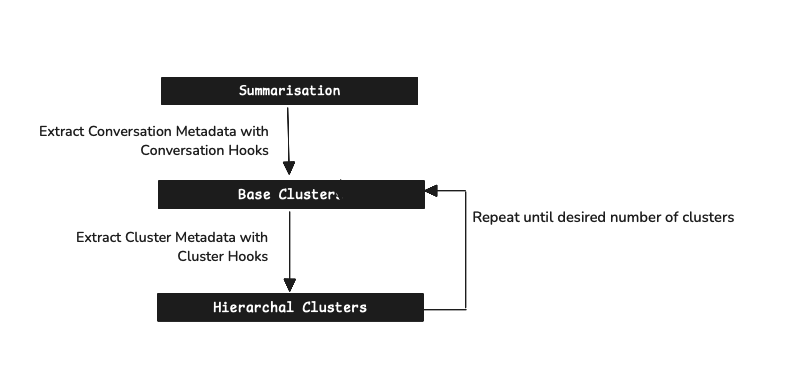

# Kura: Procedural API for Chat Data Analysis



[](https://pypi.org/project/kura/)
[](https://github.com/567-labs/kura/stargazers)
[](https://567-labs.github.io/kura/)
[](https://opensource.org/licenses/MIT)
[](https://pypi.org/project/kura/)
[](https://pypi.org/project/kura/)

**Your AI assistant handles thousands of conversations daily. But do you know what users actually need?**

Kura is an open-source library for understanding chat data through machine learning, inspired by [Anthropic's CLIO](https://www.anthropic.com/research/clio). It automatically clusters conversations to reveal patterns, pain points, and opportunities hidden in your data.

## The Hidden Cost of Not Understanding Your Users

Every day, your AI assistant or chatbot has thousands of conversations. Within this data lies critical intelligence:

- **80% of support tickets** stem from 5 unclear features
- **Feature requests** repeated by hundreds of users differently
- **Revenue opportunities** from unmet needs
- **Critical failures** affecting user trust

### What Kura Does

Kura transforms unstructured conversation data into structured insights:

```
10,000 conversations → AI Analysis → 20 clear patterns
```

- **Intent Discovery**: Find what users actually want
- **Failure Detection**: Identify AI shortcomings early
- **Feature Prioritization**: See which missing features matter most
- **Semantic Clustering**: Group by meaning, not keywords
- **Privacy-First**: Analyze patterns without exposing conversations

## Key Features

- **Smart Summarization**: Convert conversations to task descriptions (with caching!)
- **Hierarchical Clustering**: Multi-level grouping
- **Metadata Extraction**: Language, sentiment, topics
- **Fully Extensible**: Bring your own models
- **Checkpoint System**: Never lose progress
- **Performance Optimized**: MiniBatch clustering, parallel processing
- **Web UI**: Interactive cluster visualization

## Installation

```bash
# Install from PyPI
pip install kura

# Or use uv for faster installation
uv pip install kura
```

## Quick Start

```python
from kura import (
    summarise_conversations,
    generate_base_clusters_from_conversation_summaries,
    reduce_clusters_from_base_clusters,
    reduce_dimensionality_from_clusters,
    CheckpointManager
)
from kura.types import Conversation
from kura.summarisation import SummaryModel
from kura.cluster import ClusterModel
from kura.meta_cluster import MetaClusterModel
from kura.dimensionality import HDBUMAP
import asyncio

# Load conversations
conversations = Conversation.from_hf_dataset(
    "ivanleomk/synthetic-gemini-conversations",
    split="train"
)

# Set up models with new caching support!
summary_model = SummaryModel(
    enable_caching=True,  # NEW: 85x faster on re-runs!
    cache_dir="./.summary_cache"
)
cluster_model = ClusterModel()
meta_cluster_model = MetaClusterModel(max_clusters=10)
dimensionality_model = HDBUMAP()

# Set up checkpoint manager
checkpoint_mgr = CheckpointManager("./checkpoints", enabled=True)

# Run pipeline with explicit steps
async def process_conversations():
    # Step 1: Generate summaries
    summaries = await summarise_conversations(
        conversations,
        model=summary_model,
        checkpoint_manager=checkpoint_mgr
    )

    # Step 2: Create base clusters
    clusters = await generate_base_clusters_from_conversation_summaries(
        summaries,
        model=cluster_model,
        checkpoint_manager=checkpoint_mgr
    )

    # Step 3: Build hierarchy
    meta_clusters = await reduce_clusters_from_base_clusters(
        clusters,
        model=meta_cluster_model,
        checkpoint_manager=checkpoint_mgr
    )

    # Step 4: Project to 2D
    projected = await reduce_dimensionality_from_clusters(
        meta_clusters,
        model=dimensionality_model,
        checkpoint_manager=checkpoint_mgr
    )

    return projected

# Execute the pipeline
results = asyncio.run(process_conversations())
visualise_pipeline_results(results, style="enhanced")

# Expected output:
Programming Assistance Clusters (190 conversations)
├── Data Analysis & Visualization (38 conversations)
│   ├── "Help me create R plots for statistical analysis"
│   ├── "Debug my Tableau dashboard performance issues"
│   └── "Convert Excel formulas to pandas operations"
├── Web Development (45 conversations)
│   ├── "Fix React component re-rendering issues"
│   ├── "Integrate Stripe API with Next.js"
│   └── "Make my CSS grid responsive on mobile"
└── ... (more clusters)

Performance: 21.9s first run → 2.1s with cache (10x faster!)
```

## Performance Features

### Smart Caching (New in v0.3.0+)

Kura now includes intelligent caching for expensive operations:

```python
# Enable caching for 85x faster development iterations
summary_model = SummaryModel(
    enable_caching=True,
    cache_dir="./.kura_cache",
    cache_ttl_days=7,  # Auto-expire old entries
)

# Cache automatically handles:
# - Content-based deduplication
# - Thread-safe operations
# - Automatic cleanup
# - Cross-session persistence
```

### Parallel Processing

```python
# Process multiple conversations simultaneously
summary_model = SummaryModel(
    max_concurrent_requests=100,  # Parallel API calls
    enable_caching=True,
)
```

### MiniBatch Clustering

```python
# Handle large datasets efficiently
from kura.k_means import MiniBatchKmeansClusteringMethod

clustering = MiniBatchKmeansClusteringMethod(
    batch_size=1000,  # Process in chunks
    clusters_per_group=10,
)
```

## Documentation

**Installation**: [Get started](getting-started/installation.md) with Kura today. Install via pip or uv and configure your first analysis pipeline.

**Quickstart**: [Jump right in](getting-started/quickstart.md) with a complete example that processes conversations from raw data to insights in minutes.

**Complete Workflow**: [See how a full analysis looks](notebooks/how-to-look-at-data.md) from loading data to interpreting clusters and extracting actionable insights.

**Core Concepts**: Learn how Kura works under the hood - from [conversation loading](core-concepts/conversations.md) and [embedding](core-concepts/embedding.md) to [clustering](core-concepts/clustering.md), [summarization](core-concepts/summarization.md), [meta-clustering](core-concepts/meta-clustering.md), and [dimensionality reduction](core-concepts/dimensionality-reduction.md).

**API Reference**: [Complete documentation](api/index.md) of Kura's procedural API with examples and best practices.

## Frequently Asked Questions

1. **Can Kura work with my data and models?** Yes! Kura supports any conversation format (JSON, CSV, databases) and works with OpenAI, Anthropic, local models, or custom implementations.

2. **How much data do I need?** Start with 100+ conversations for basic patterns, 1,000+ for robust clustering, or 10,000+ for detailed insights.

3. **Is my data secure?** Absolutely. Run Kura entirely on your infrastructure, use local models for complete isolation, and analyze patterns without exposing individual conversations.

4. **What languages does Kura support?** Any language supported by your chosen model - from English to 90+ languages with models like GPT-4.

5. **Can I integrate Kura into my application?** Yes, Kura is designed as a library for seamless integration into your existing async applications.

## About

Kura is under active development. If you face any issues or have suggestions, please feel free to [open an issue](https://github.com/567-labs/kura/issues) or a PR. For more details on the technical implementation, check out this [walkthrough of the code](https://ivanleo.com/blog/understanding-user-conversations).
